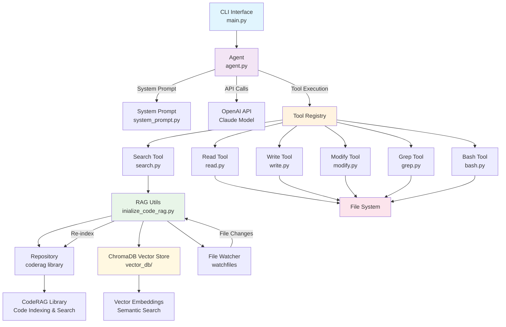

# Koder Architecture Diagram

## System Overview
Koder is an AI-powered coding assistant with RAG (Retrieval-Augmented Generation) capabilities, built using Claude API and vector search.



## Component Breakdown

### 1. **Entry Point (`main.py`)**
- **Purpose**: CLI interface and application bootstrap
- **Key Functions**:
  - Initialize RAG system in background thread
  - Set up Agent with tools and system prompt
  - Run interactive user loop
- **Dependencies**: Agent, all tools, system prompt, RAG utils

### 2. **Core Agent (`agent/agent.py`)**
- **Purpose**: OpenAI API orchestration and conversation management
- **Key Functions**:
  - Handle chat completions with tool calling
  - Execute and manage tool calls
  - Maintain conversation context
- **Dependencies**: OpenAI client, tool registry

### 3. **Tool System (`tools/`)**
- **Read Tool**: File content retrieval with line range support
- **Write Tool**: File creation and overwriting
- **Modify Tool**: Multi-edit operations on existing files
- **Grep Tool**: Pattern search with regex support
- **Bash Tool**: Safe shell command execution
- **Search Tool**: RAG-powered semantic code search

### 4. **RAG System (`utils/inialize_code_rag.py`)**
- **Purpose**: Code repository indexing and semantic search
- **Key Components**:
  - Repository initialization and indexing
  - Vector store management (ChromaDB)
  - File change monitoring and re-indexing
  - Semantic search capabilities
- **Dependencies**: coderag library, ChromaDB, watchfiles

### 5. **System Prompt (`prompts/system_prompt.py`)**
- **Purpose**: Agent behavior and instruction definition
- **Features**: Tool usage guidelines, communication rules, coding standards

## Data Flow

### 1. **Initialization**
```
main.py → initialize_code_rag() → Repository.index() → ChromaDB
```

### 2. **User Interaction**
```
User Input → Agent.query() → OpenAI API → Tool Execution → Response
```

### 3. **RAG Search**
```
Search Query → search_similar_code() → Repository.search() → ChromaDB → Results
```

### 4. **File Monitoring**
```
File Changes → watchfiles → Re-index Repository → Update ChromaDB
```

## Key Features

- **Real-time Code Indexing**: Automatic re-indexing on file changes
- **Semantic Search**: Vector-based code similarity search
- **Multi-tool Support**: Comprehensive file operations and system commands
- **Safe Execution**: Security checks for bash commands
- **Context Awareness**: Maintains conversation history and system context

## Technology Stack

- **AI Model**: Claude 3.7 Sonnet (via OpenAI-compatible API)
- **Vector Database**: ChromaDB for embeddings storage
- **Code Analysis**: CodeRAG library for repository indexing
- **File Monitoring**: watchfiles for real-time change detection
- **Language**: Python 3.10+ with type hints
- **Code Quality**: Black, Ruff, MyPy for formatting and linting